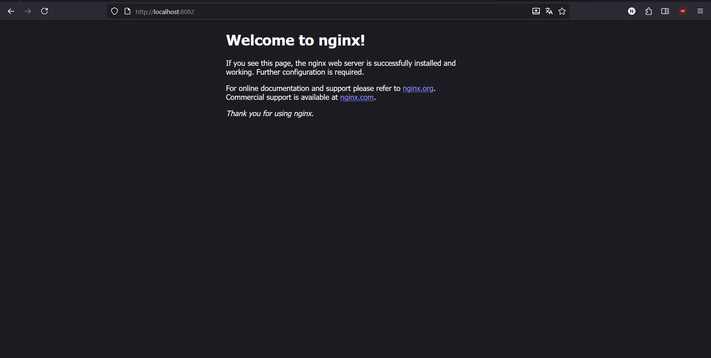

# Projeto: Implementação de um Fluxo GitOps na Prática

## 1. Visão Geral do Projeto

Este documento detalha a execução de um projeto prático para implantar aplicações em um ambiente Kubernetes. O principal objetivo foi utilizar a metodologia **GitOps**, onde o repositório Git serve como a única fonte para definir o estado desejado da infraestrutura e das aplicações, garantindo um fluxo de entrega automatizado, seguro e auditável.

## 2. Ferramentas e Conceitos-Chave

* **Kubernetes:** Orquestrador de contêineres responsável por gerenciar a execução, escalonamento e resiliência das aplicações.
* **Git (com GitHub):** Sistema de controle de versão utilizado para armazenar tanto o código-fonte quanto os manifestos declarativos da aplicação.
* **GitOps:** Metodologia que utiliza o Git como fonte da verdade. Alterações na aplicação ou infraestrutura são feitas via `git push`.
* **ArgoCD:** Ferramenta de GitOps que sincroniza o estado do cluster Kubernetes com o que está definido no repositório Git.
* **Helm:** Gerenciador de pacotes para o Kubernetes. Ele agrupa todos os recursos de uma aplicação em um pacote reutilizável chamado "Chart".
* **Rancher Desktop:** Software para executar um cluster Kubernetes em um ambiente de desenvolvimento local.

## 3. Fases do Projeto

O desenvolvimento do projeto foi estruturado em fases incrementais, começando com uma implantação básica e evoluindo para práticas mais avançadas de segurança e gerenciamento de pacotes.

### Fase 1: Implantação Inicial com GitOps

* **Objetivo:** Implantar a aplicação de microserviços "Online Boutique", utilizando um fluxo GitOps básico para validar a configuração do ambiente Kubernetes local, gerenciado pelo Rancher Desktop.
* **Processo:**
    1.  **Preparação do Repositório:** Um repositório Git (`gitops-microservices`) foi criado para servir como a "fonte da verdade", conforme a metodologia GitOps. Este repositório foi populado com o manifesto Kubernetes da aplicação (`online-boutique.yaml`), obtido a partir de um fork do projeto oficial `GoogleCloudPlatform/microservices-demo`.
    2.  **Instalação do ArgoCD:** A ferramenta de GitOps, ArgoCD, foi instalada no cluster Kubernetes através de seu manifesto de instalação padrão.
    3.  **Configuração da Aplicação:** Uma nova aplicação foi configurada no painel do ArgoCD, estabelecendo a conexão entre o repositório GitOps e o cluster Kubernetes local. A política de sincronização foi definida como automática, para que qualquer alteração no Git fosse refletida no cluster.
* **Resultado:** O ArgoCD sincronizou o estado do cluster com os manifestos do repositório, implantando todos os microserviços com sucesso. O acesso ao frontend foi viabilizado através do comando `kubectl port-forward`, confirmando a funcionalidade do ambiente.

### Fase 2: Validação do Fluxo com Teste de Escalabilidade

* **Objetivo:** Validar a automação e a reatividade do ciclo GitOps através de uma alteração declarativa na configuração da aplicação, conforme sugerido como passo opcional no plano do projeto.
* **Processo:** O manifesto `online-boutique.yaml` foi modificado diretamente, alterando o número de réplicas (`replicas: 3`) do `Deployment` para o serviço `loadgenerator`. A alteração foi enviada ao repositório Git através de um `git push`.
* **Resultado:** Conforme o esperado, o ArgoCD detectou a alteração no Git e, sem intervenção manual, ajustou o estado do cluster, escalando o número de pods do serviço para 3. Esta fase confirmou a eficácia do fluxo GitOps para gerenciar o ciclo de vida das aplicações.

### Fase 3: Adoção de Repositório Privado e Acesso via SSH

* **Objetivo:** Aumentar a segurança do projeto, migrando o repositório para um ambiente privado e configurando o acesso seguro para a ferramenta de automação.
* **Processo:**
    1.  **Privacidade:** A visibilidade do repositório no GitHub foi alterada de "Public" para "Private".
    2.  **Autenticação:** Um par de chaves SSH foi gerado. A chave pública foi configurada como uma "Deploy Key" no GitHub (com acesso somente leitura), e a chave privada foi armazenada como um segredo no ArgoCD.
    3.  **Reconfiguração:** A configuração da aplicação no ArgoCD foi atualizada para usar a URL do repositório no formato SSH.
* **Resultado:** O ArgoCD estabeleceu uma conexão segura e autenticada com o repositório privado, mantendo a capacidade de sincronização e automação em um ambiente seguro, mais próximo de um cenário de produção.

### Fase 4: Empacotamento e Implantação com Helm

* **Objetivo:** Utilizar o Helm, o gerenciador de pacotes do Kubernetes, para empacotar e implantar uma nova aplicação (Nginx), demonstrando uma abordagem mais avançada e reutilizável de gerenciamento de configurações.
* **Processo:**
    1.  **Criação do Chart:** Um "Chart" Helm foi criado com o comando `helm create nginx-chart`.
    2.  **Customização:** O arquivo `values.yaml` foi customizado para utilizar a imagem `nginx:latest`, e os templates na pasta `templates/` foram simplificados para um deploy básico.
    3.  **Implantação:** Uma segunda aplicação (`nginx-helm`) foi criada no ArgoCD, desta vez apontando para o diretório do Helm Chart (`nginx-chart`) dentro do repositório GitOps.
* **Resultado:** O ArgoCD identificou, renderizou e implantou o Helm Chart com sucesso, criando os recursos do Nginx no cluster. Isso demonstrou a capacidade do fluxo GitOps de gerenciar e implantar aplicações empacotadas com Helm, uma prática padrão na indústria.

## 4. Resultados

* **Aplicações Rodando**
  
* **Escalabilidade loadgenerator**
  
* **Online Boutique funcionando**
  
* **Nginx Funcionando**
  

